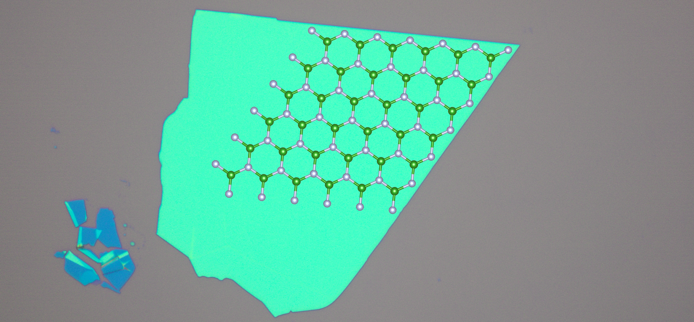
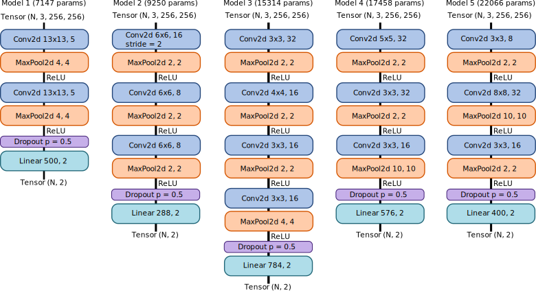
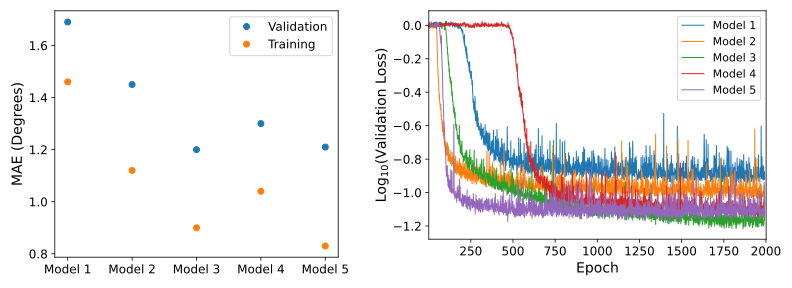

# AxisID
One of the most striking features of crystals is the tendency to cleave along specific directions with respect to the underlying atomic lattice. This is not just true for typical 3D crystals, but also 2D crystals currently studied in physics research [[1]](#1):

<p align = "center">

</p>
  
*Microscope image of a 2D boron nitride crystal with the crystal structure overlaid. The crystal tends to cleave along high-symmetry directions of the crystal lattice, which occur every 30 degrees.*

It is common in research labs to use straight edges to estimate the crystallographic oritentation of a 2D crystal. Empirically, the accuracy of this technique is about 1 degree; experiments have come to require much higher (0.1 degree) angular precision so other methods are preferred. Nevertheless, I was curious to see if this technique can be automated. 

It is tempting to automate this without machine learning, by using edge detectors to identify edges and then fitting the peaks in a histogram of edge angles. However, it takes intuition to pick the "straight edges," and there are difficult cases. Here is an example where there are some fairly straight edges that aren't aligned with the crystal axes:

<p align = "center">

</p>

*Left: Boron nitride crystal with some edges indicated. Right: histogram of the angles of indicated edges (moduluo 30 degrees). The color of the bars correspond to the color of the edges in the left panel. The correct value of the crystallographic orientation is about 16.1 degrees.*

A human will be able to pick the straighter edges (shown in black) and correctly determine the crystallographic orientation. There are other factors that make automation difficult, such as inconsistent illumination, inconsistent contrast, and anomalous features like polymer residues or dirt. I decided to train convolutional neural nets (CNN) on labelled examples to see if they can solve the task. 

### Requirements
Python 3.8.10, Pillow 7.2.0, NumPy 1.19.1, Matplotlib 3.3.4, PyTorch 1.8.1

### Usage

This repository contains code necessary to train CNNs on the axis orientation task. The main script is ```train.py``` which can be run from the command line using:

```
python train.py --cuda --image_dir images --angles_path angles.csv
```

`image_dir` is the path to the training images, assumed to be JPEG or TIFF images, and `angles_path` is the path to the labels file with rows of labels in the format: *basename, axis_angle, count*. This format allows pre-computed data augmentation with the following convention: for each *basename* there should be *count* images in `image_dir` with names *basename-n*.jpg or *basename-n*.tif, where *n* ranges from 0 to *count*-1. To see the full list of arguments, call `python train.py -h`. Arguments can be passed via file using `@` as a prefix.

The other script is ```test_model.py``` which allows easy testing on the test set, or re-evaluation on the training set. It is run from the command line using:

```
python test_model.py --image_dir images --annotation_dir annotations --weights_path path_to_model
```

For each image in `image_dir` with filename *image*.tif or *image*.jpg there should be a corresponding file in `annotation_dir` with filename *image*-edges.csv. The first line of *image*-edges.csv should contain the ground-truth crystallographic orientation for the image. 

The other two important modules are `model.py`, which defines the model, and `scheduler.py` which defines the learning rate scheduler. The default is a step decay schedule (see [StepLR](https://pytorch.org/docs/stable/generated/torch.optim.lr_scheduler.StepLR.html)). The parameters of the scheduler should be passed to `train.py` using`--scheduler_params`. If none are passed no scheduler is used.

One final comment is that the predicted and ground-truth angles are only compared moduluo 30 degrees in the loss function. This is because, for hexagonal boron nitride and graphene, the crystal axis orientation can only be determined moduluo 30 degrees from microscope images. For other materials a different value might be necessary; to change the value change the `modulus` variable in `shared_functions.py`.

### Results

To train the model I first determined the crystallographic orientation for 2681 boron nitride flakes using a [custom GUI labeling tool](https://github.com/dmacneill/axis-annotation-tool). I randomly chose 672 images to be used as the test set. From the remaining 2009 images, I generated 18,691 256x256 pixel TIFF images by cropping each image into a square mutliple times with different cropping windows and resizing the squares to 256x256 pixels.

I then chose 5 small CNN architectures somewhat randomly to get a feel for their performance, the architectures are:

<p align ="center">

</p>

I trained the models for 2000 epochs using the [AdamW](https://pytorch.org/docs/stable/generated/torch.optim.AdamW.html) optimizer with constant parameters `lr=3e-4`, `weight _decay=0.05` and `betas=(0.9, 0.99)`. The batch size was 64 or 128 depending on the model size (constrained by my GPU memory). I witheld 20% of the training set to use as the validation set. The results of these initial training runs are plotted below:

<p align ="center">

</p>

Model 3 gives the best performance, despite having a lower parameter count than Model 4 and Model 5. I decided to retrain Model 3 with a step-decay and 1cycle learning rate policy. The best results were obtained with the 1cycle policy: 

### References

<a id="1">[1]</a> Y. Gao *et al.,* "Distinctive in-Plane Cleavage Behaviors of Two-Dimensional Layered Materials", *ACS Nano*, 10(9):8980-8 (2016)
