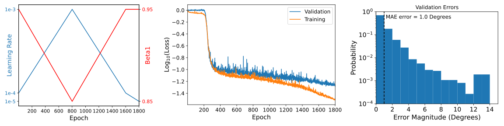

# AxisID
A striking features of crystals is the tendency to cleave along specific directions with respect to the underlying atomic lattice. This is true even for the two-dimensional crystals currently studied in physics research [[1]](#1):

<p align = "center">

</p>
  
*Microscope image of a 2D boron nitride crystal with the crystal structure overlaid. The crystal tends to cleave along high-symmetry directions of the crystal lattice, which occur every 30°.*

It is common in research labs to use straight edges to estimate the crystallographic oritentation of a 2D crystal. Empirically, the accuracy of this technique is about 1°. However, this method is difficult to automate, since it takes intuition to pick the "straight edges," and there are difficult cases. Here is an example where there are some straight edges that aren't aligned with the crystal axes:

<p align = "center">

</p>

*Left: Boron nitride crystal with some edges indicated. Right: histogram of the angles of indicated edges (moduluo 30°). The color of the bars correspond to the color of the edges in the left panel. The correct value of the crystallographic orientation is about 16.1°.*

A human will be able to pick the straighter edges (shown in black) and correctly determine the crystallographic orientation. There are other factors that make automation difficult, such as inconsistent illumination, inconsistent contrast, and anomalous features like polymer residues or dirt. I decided to train convolutional neural nets (CNN) on labelled examples to see if they can solve the task. 

### Requirements
Python 3.8.10, Pillow 7.2.0, NumPy 1.19.1, Matplotlib 3.3.4, PyTorch 1.8.1

### Usage

This repository contains code necessary to train CNNs on the axis orientation task. The main script is `train.py` which can be run from the command line:

```
python train.py --cuda --image_dir images --angles_path angles.csv
```

`image_dir` is the path to the training images, and `angles_path` is the path to the labels file with rows of labels in the format: filename, axis_angle, *N*. This format allows pre-computed data augmentation with the following convention: for each filename there should be *N* images in `image_dir` with names filename-*n*.jpg or filename-*n*.tif, where *n* ranges from 0 to *N*-1. To see the full list of arguments, call `python train.py -h`. Arguments can be passed via file using `python train.py @config.txt`.

The other two important modules are `model.py`, which defines the model, and `schedulers.py` which defines the learning rate schedulers. The implemented schedulers are constant learning rate, [step-decay](https://pytorch.org/docs/stable/generated/torch.optim.lr_scheduler.StepLR.html), and [one-cycle](https://www.fast.ai/2018/07/02/adam-weight-decay/).

The predicted and ground-truth angles are only compared moduluo 30° in the loss function. This is because, for hexagonal boron nitride and graphene, the crystal axis orientation can only be determined moduluo 30° from microscope images. For other materials a different value might be necessary; to change the value change the `modulus` variable in `shared_functions.py`.

### Results

To train the model I first determined the crystallographic orientation for 2681 boron nitride flakes using a [custom GUI labeling tool](https://github.com/dmacneill/axis-annotation-tool). I randomly chose 672 images to be used as the test set. From the remaining 2009 images, I generated 18,691 256x256 pixel images by cropping each image into a square mutliple times with different cropping windows and resizing the squares to 256x256 pixels.

I then chose 5 small CNN architectures somewhat randomly to get a feel for their performance, the architectures are:

<p align ="center">

</p>

I trained the models for 2000 epochs using the [AdamW](https://pytorch.org/docs/stable/generated/torch.optim.AdamW.html) optimizer with constant parameters `lr=3e-4`, `weight _decay=0.05` and `betas=(0.9, 0.99)`. The batch size was 64 or 128 depending on the model size (constrained by my GPU memory). I witheld 20% of the training set to use as the validation set. For data-augmentation, each sample was randomly rotated by 0°, 90°, 180°, or 270° and randomly flipped vertically or not, during both training and validation. The results of these initial training runs are plotted below:

<p align ="center">

</p>

Model 3 gives the best performance, despite having fewer parameters than Model 4 and Model 5. I decided to retrain Model 3 with both step-decay and one-cycle learning rate policies. The best results were obtained with the one-cycle policy: 

<p align ="center">

</p>

Note that the maximum error is 15°, and the MAE error from a random policy is 7.5°. I also checked the performance of this model on the test set. For comparison, I labeled the test set twice, and used the second pass as ground truth. The differences between the two labellings are plotted as "Baseline Errors" below:

<p align ="center">

</p>

We can see the model is still worse than human performance. The lack of data-augmentation in the test set means that it is much smaller than the training or validation sets, and the outlier bin in both cases comes from a single example (not the same example for both). It would be good recompute these errors using a larger test set to improve the statistics.

Finally, I trained a modified version of PyTorch's built-in ResNet-18 on the axis-identifaction task. I replaced the last two blocks with identity operations resulting in a network with nine convolutional layers, one fully-connected layer, and 683330 parameters total. To obtain better performance than Model 3, it was necessary to include additional data-augmentation operations (activated by passing the `--full_augmentation` flag to `train.py`). The results are shown below:

<p align ="center">

</p>

### References

<a id="1">[1]</a> Y. Gao *et al.,* "Distinctive in-Plane Cleavage Behaviors of Two-Dimensional Layered Materials", *ACS Nano*, 10(9):8980-8 (2016)
